# Personal AI 项目数据流和处理流程

## 1. 数据收集流程 (Data Collection Flow)

### 1.1 初始化阶段
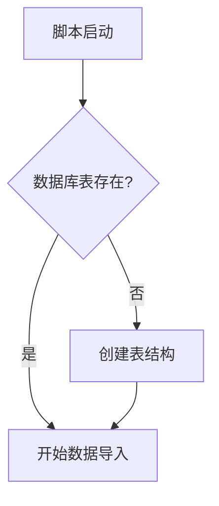

### 1.2 笔记数据收集流程

### 1.3 博客数据收集流程
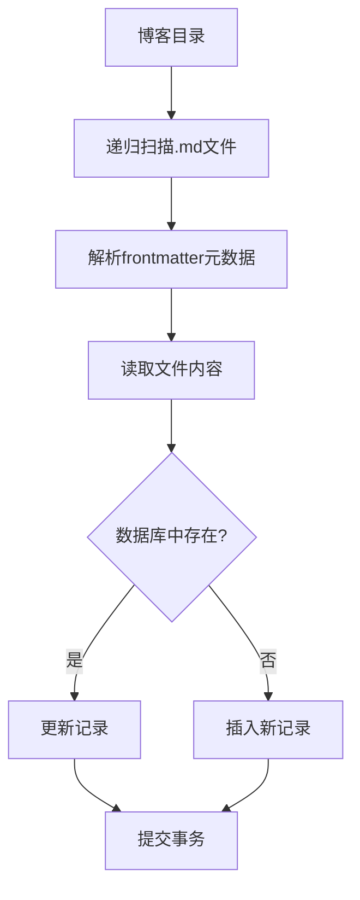

### 1.4 照片数据收集流程
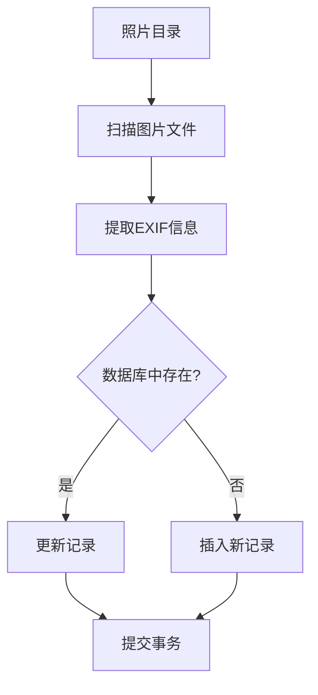

## 2. 数据处理流程 (Data Processing Flow)

### 2.1 数据摘要处理流程
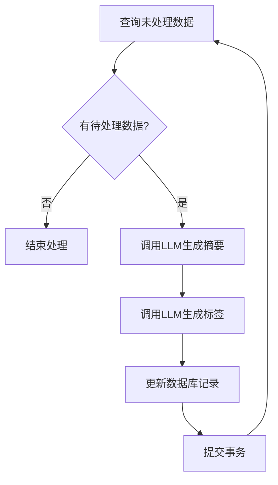

### 2.2 文本摘要流程
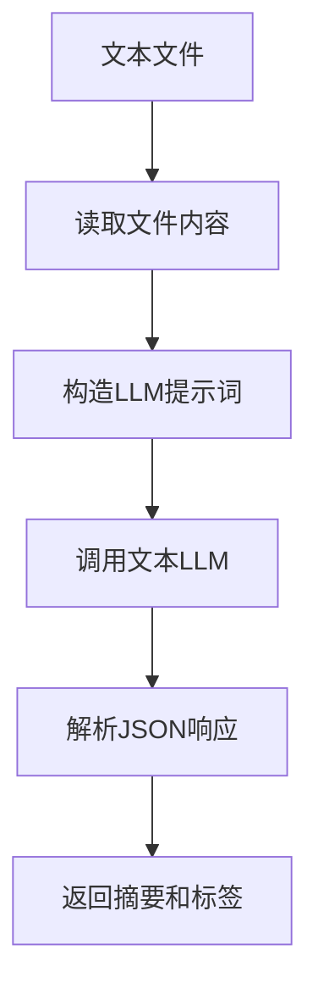

### 2.3 图片摘要流程
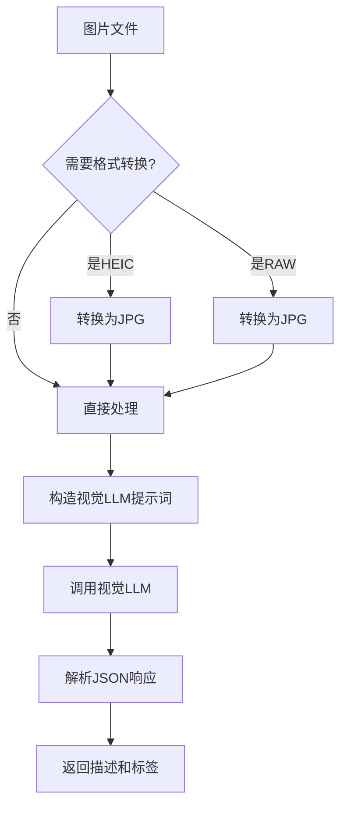

## 3. 向量索引流程 (Vector Indexing Flow)

### 3.1 向量索引构建流程
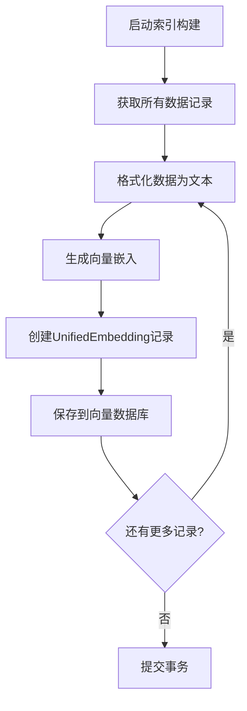

### 3.2 数据格式化流程
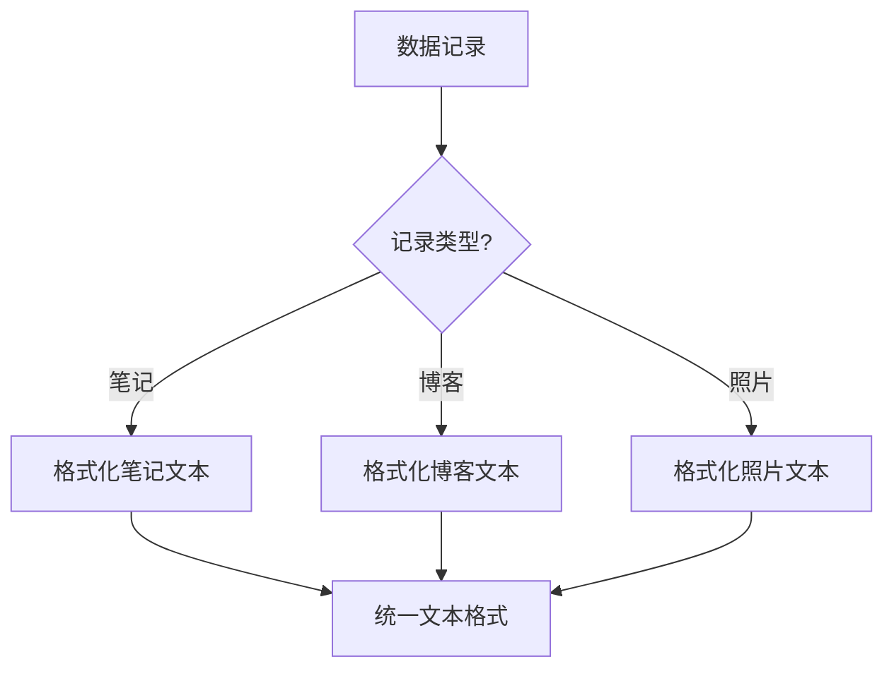

## 4. 知识图谱构建流程 (Knowledge Graph Building Flow)

### 4.1 知识图谱构建流程
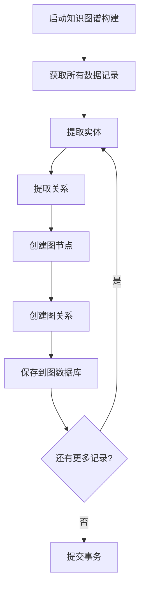

### 4.2 实体提取流程
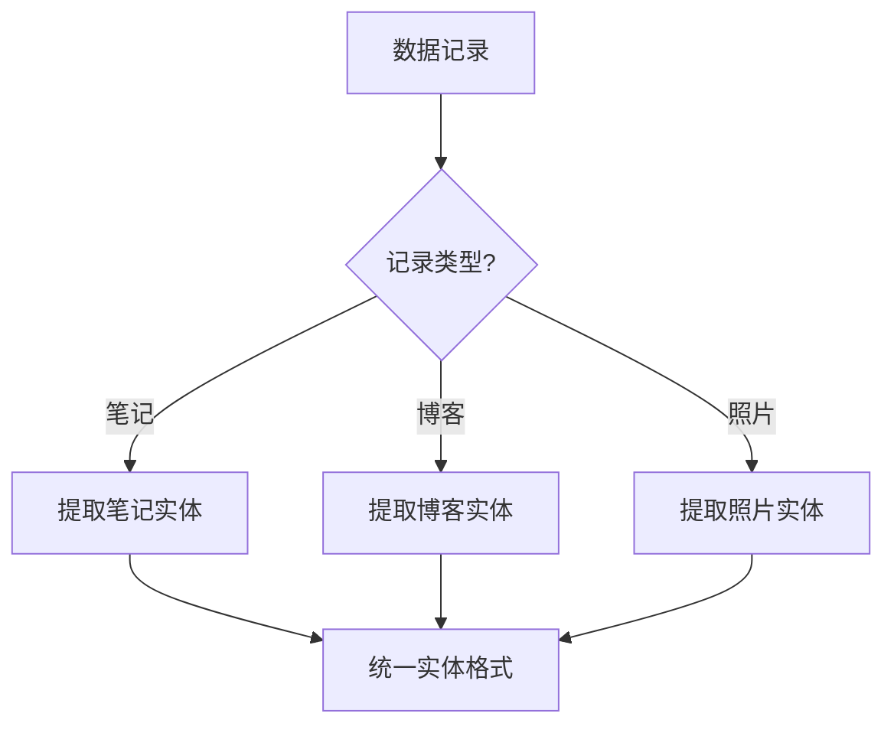

### 4.3 关系提取流程
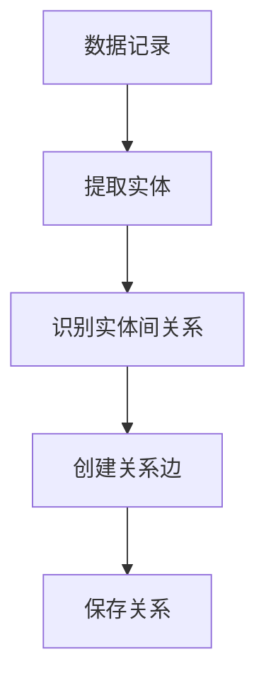

## 5. 查询处理流程 (Query Processing Flow)

### 5.1 API 查询处理流程
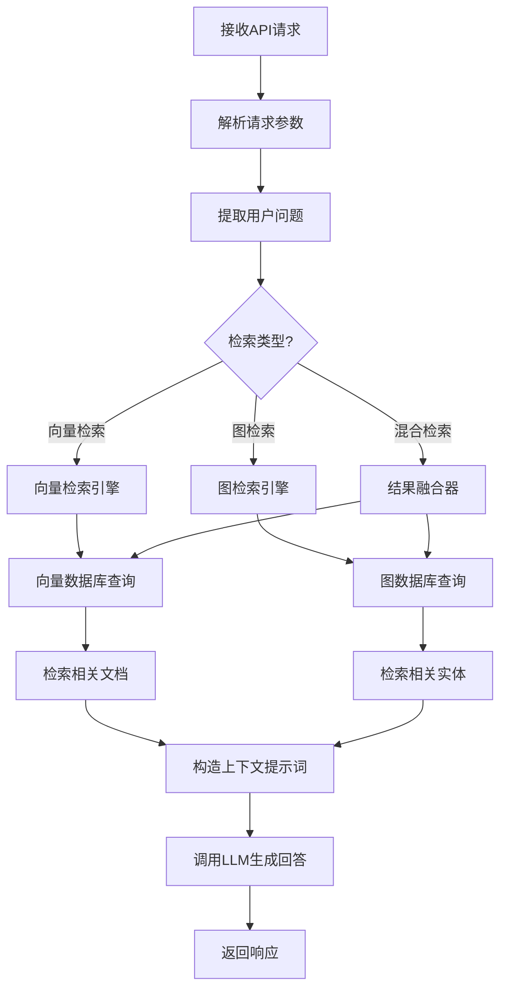

### 5.2 向量检索流程
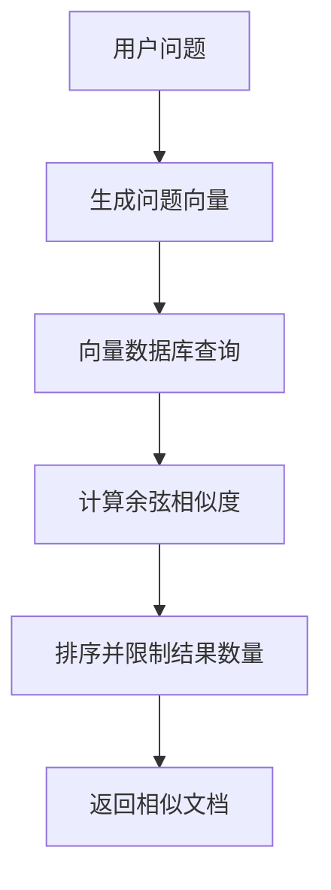

### 5.3 图检索流程
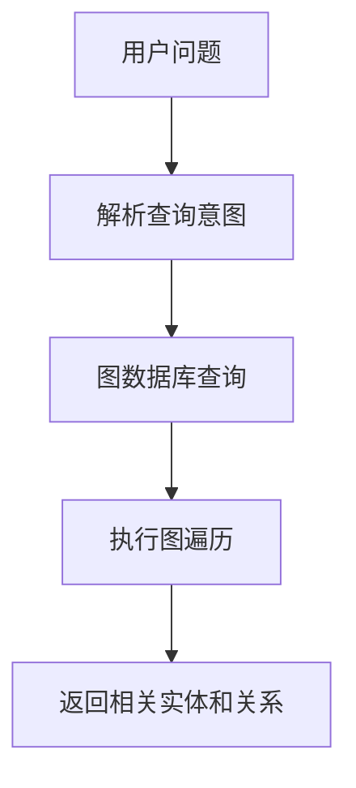

### 5.4 结果融合流程
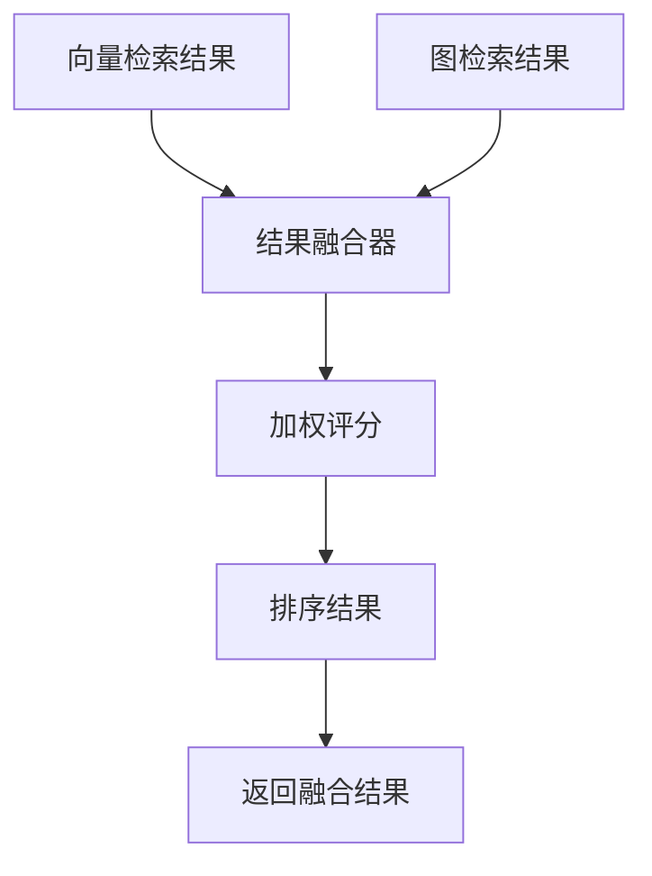

### 5.5 回答生成流程
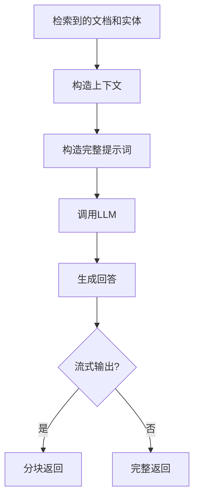

## 6. 完整数据生命周期 (Complete Data Lifecycle)

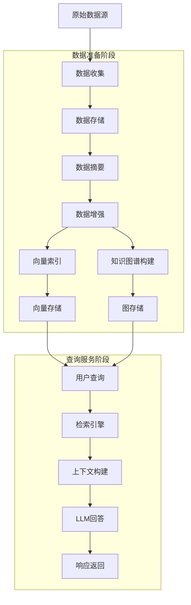

## 7. 关键处理步骤详解

### 7.1 数据收集阶段
1. **脚本启动**: 运行 `scripts/import_personal_data.py`
2. **表结构检查**: 确保数据库表已创建
3. **笔记收集**: 扫描笔记目录，解析 Markdown 文件
4. **博客收集**: 扫描博客目录，解析 Markdown 文件
5. **照片收集**: 扫描照片目录，提取 EXIF 信息

### 7.2 数据处理阶段
1. **摘要生成**: 对未处理的数据调用 LLM 生成摘要和标签
2. **文本处理**: 使用文本 LLM 分析文本内容
3. **图片处理**: 使用视觉 LLM 分析图片内容
4. **格式转换**: 对特殊格式图片（HEIC、RAW）进行转换

### 7.3 向量索引阶段
1. **数据读取**: 从数据库读取完整的结构化数据
2. **格式化**: 使用格式化器将数据转换为统一文本格式
3. **嵌入生成**: 调用嵌入模型生成向量表示
4. **索引存储**: 将向量嵌入存储到向量数据库

### 7.4 知识图谱构建阶段
1. **数据读取**: 从数据库读取完整的结构化数据
2. **实体提取**: 从数据中提取实体信息
3. **关系提取**: 识别实体间的关系
4. **图构建**: 在图数据库中创建节点和关系

### 7.5 查询服务阶段
1. **请求接收**: API 服务器接收用户查询请求
2. **检索执行**: 根据查询类型执行向量检索、图检索或混合检索
3. **结果融合**: 融合多种检索方式的结果
4. **上下文构建**: 将检索到的内容构造成上下文提示词
5. **回答生成**: 调用 LLM 生成基于上下文的回答
6. **响应返回**: 将回答返回给用户

## 8. 并发处理和性能考虑

### 8.1 批量处理
- 数据收集和摘要处理使用批量操作提高效率
- 使用 tqdm 显示进度条，提供用户反馈

### 8.2 错误处理
- 各个处理步骤都有异常捕获机制
- 失败的文件不会影响整体处理流程
- 提供详细的错误日志便于调试

### 8.3 增量处理
- 数据收集支持增量更新，避免重复处理
- 摘要生成只处理未处理或需要更新的数据

## 9. 配置驱动
- 所有路径和参数通过环境变量配置
- 支持不同的模型配置和 API 设置
- 灵活的配置管理便于部署和测试