# **📘 Qwen-Agent 多 Agent 路由架构说明（带图例完整版）**

# **1. 设计目标与整体思路**

Qwen-Agent 路由层（Router）的核心目标是：

- 将多种能力（对话 / 图片 / 代码 / 文档 / 工作流）统一暴露为 **单一入口**
- 让 LLM 自动决策使用哪个 Agent
- 保证多轮对话中的 Agent identity 延续
- 保持低耦合、可扩展、可插拔

## **🔷 整体架构图**

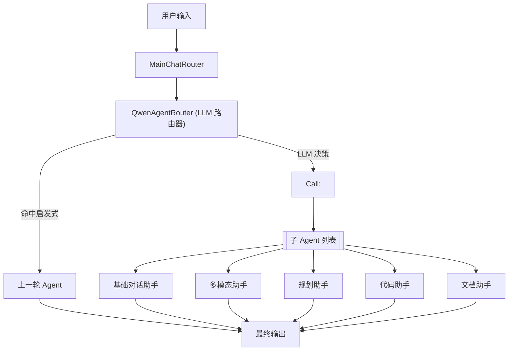

---

# **2. 核心组件说明**

## **2.1 QwenAgentRouter（路由器）**

路径：agents/core/routing/router.py

职责：

- 继承 FnCallAgent → 让 LLM 决策
- 继承 MultiAgentHub → 持有子 Agent 队列
- 强制输出格式 Call: <AgentName>
- 通过 stop=['\n'] 限定只读第一行

### **🔷 QwenAgentRouter 内部逻辑图**

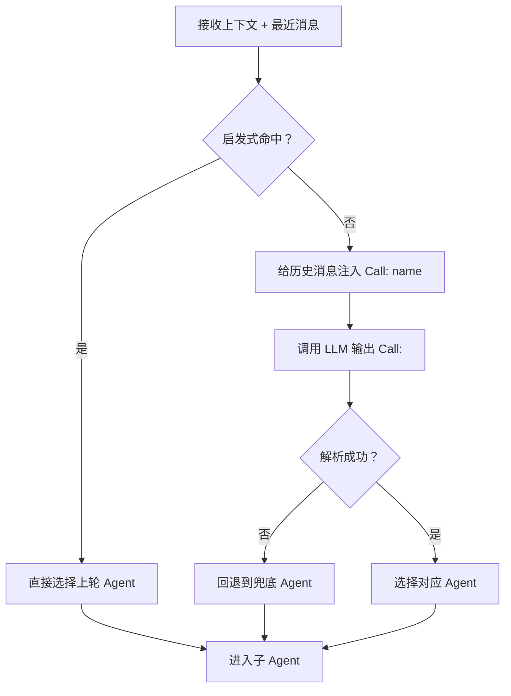

---

## **2.2 子 Agent 类型**

| **Agent 名称**  | **文件**                            | **能力**     |
| ------------- | --------------------------------- | ---------- |
| **基础对话助手**    | agents/chat/basic_chat_agent.py   | 通用问答、兜底    |
| **多模态助手**     | agents/multimodal/image_agent.py  | 图像识别、图像生成  |
| **规划助手**      | agents/planning/planning_agent.py | 多步骤工作流拆解   |
| **代码助手**      | agents/code/code_agent.py         | 代码执行、调试、生成 |
| **文档助手（可扩展）** | 自定义                               | 文件阅读、检索、翻译 |

---

# **3. 消息流与路由流程（核心链路）**

---

## **🔷 路由行为时序图**

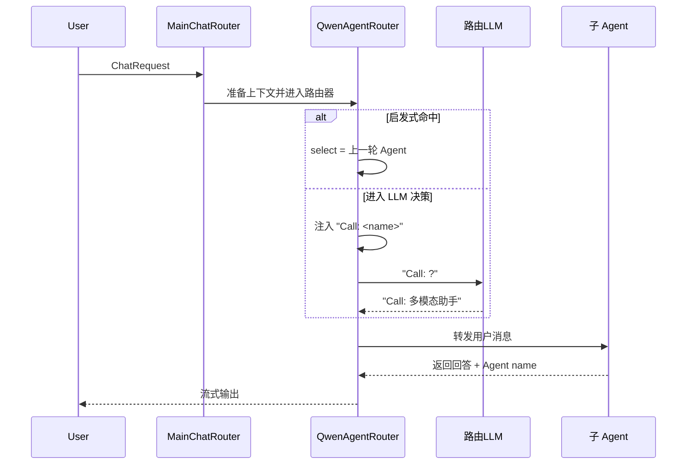

---

# **4. 路由关键逻辑图例**

---

## **4.1 启发式判断流程**

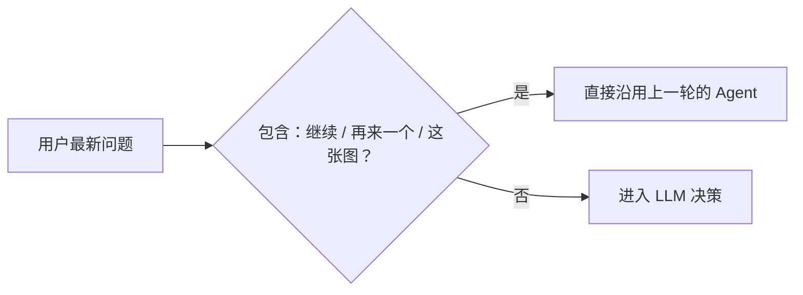

---

## **4.2 历史消息注入 Call:**

## **（提示增强）**

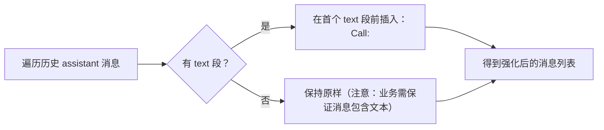

---

## **4.3 LLM 决策 Agent**

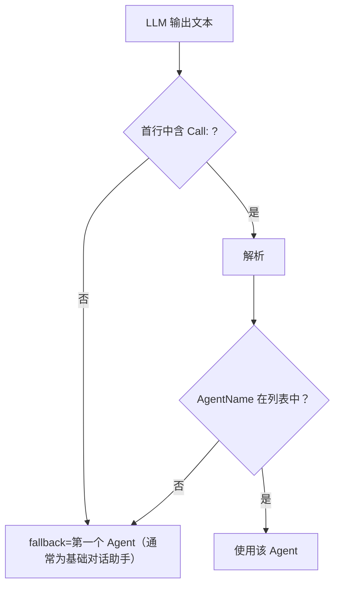

---

## **4.4 子 Agent 执行与响应回写**

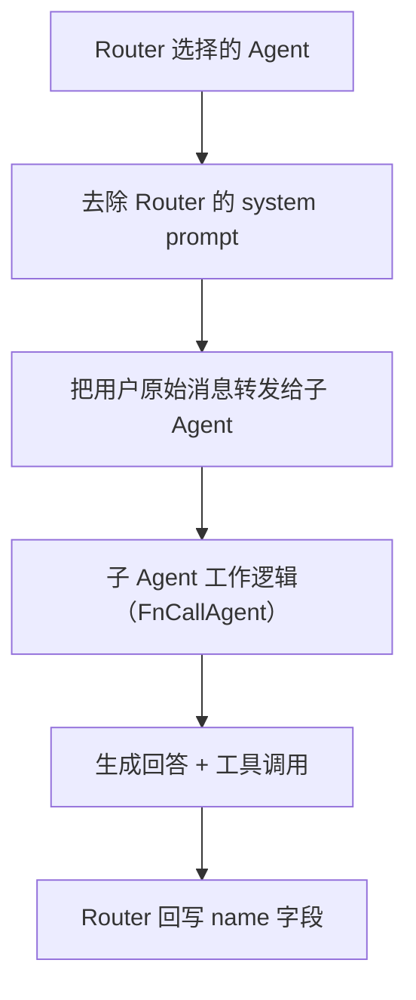

---

# **5. 工具编排（call_sub_agent）**

call_sub_agent 将“调用另一个 Agent”抽象成工具调用，使规划 Agent 在同一轮内调用多个 Agent。

---

## **🔷 call_sub_agent 工作流图**

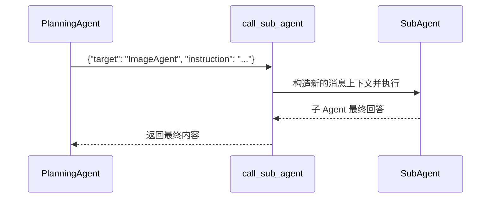

---

# **6. 底层设计原理（Why）**

---

## **6.1 为什么让 LLM 做路由？**

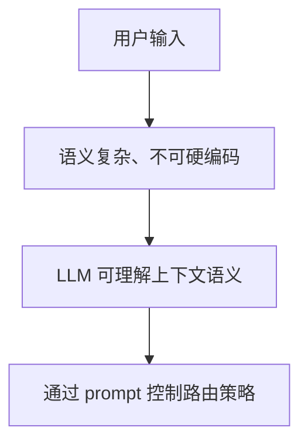

✔ 易维护

✔ 可扩展

✔ 修改 Prompt 即可调整策略

---

## **6.2 为什么要显式注入 “Call: name”**

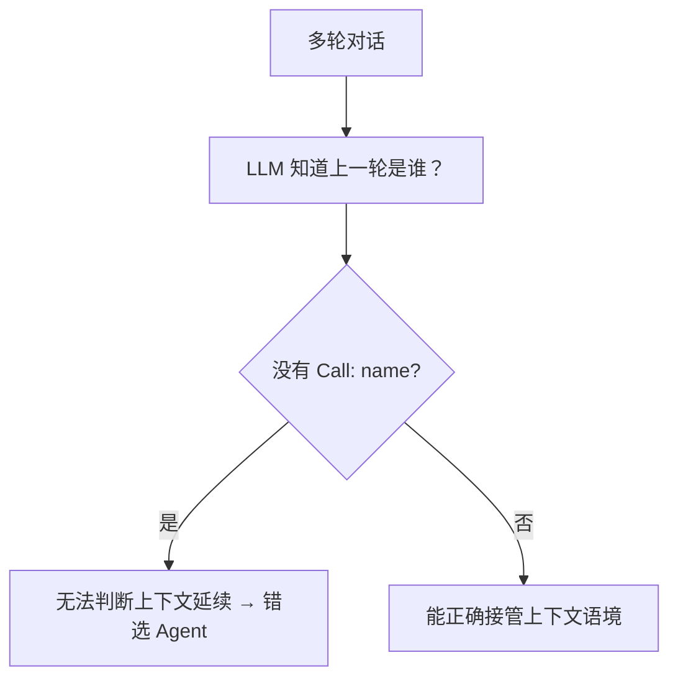

---

## **6.3 为什么要启发式兜底？**

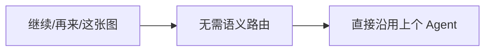

原因：

- 避免浪费模型调用
- 用户意图明确
- 保证多轮一致性

---

# **7. 扩展新 Agent 的完整接入流程（含示意图）**

---

## **7.1 步骤图**

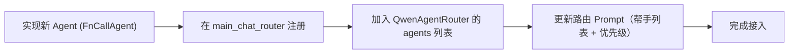

---

## **7.2 最小可用的新 Agent 模板**

```python
class BlogAgent(FnCallAgent):
    name = "博客助手"
    description = "负责博客理解与生成"

    def __init__(self):
        super().__init__(
            system_message="你是博客专家…",
            llm=qwen_llm,
            function_list=[blog_search, blog_summary]
        )
```

---

# **8. 已知局限与未来增强方向（图例增强版）**

---

## **8.1 当前局限图例**

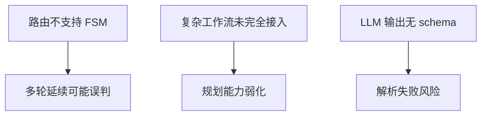

---

## **8.2 可增强方向**

- 引入意图分类器 + LLM 双路由策略
- 增加正则校验、自动重试
- 在消息 metadata 保存 agent_name
- 增加路由日志、统计、调优能力
- 将规划 Agent 全面接入路由列表

---

# **9. 关键文件总结**

```
agents/
  core/routing/router.py         # 路由器
  routers/main_chat_router.py    # 主入口
  chat/basic_chat_agent.py       # 基础对话助手
  multimodal/image_agent.py      # 多模态助手
  planning/planning_agent.py     # 工作流规划助手
  code/code_agent.py             # 代码助手
tools/
  orchestration/agent_call.py     # 子 Agent 调度工具
```
