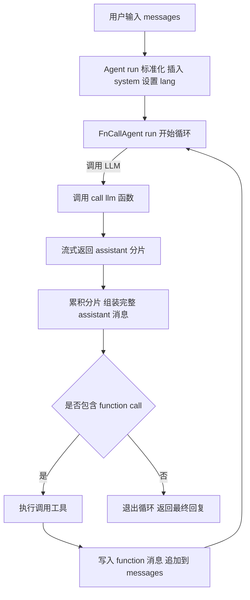
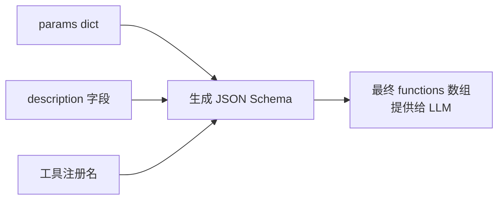
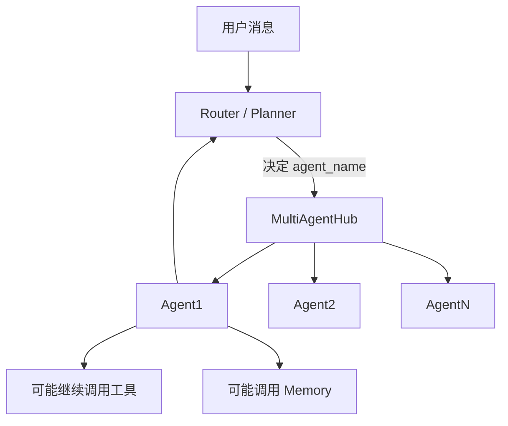
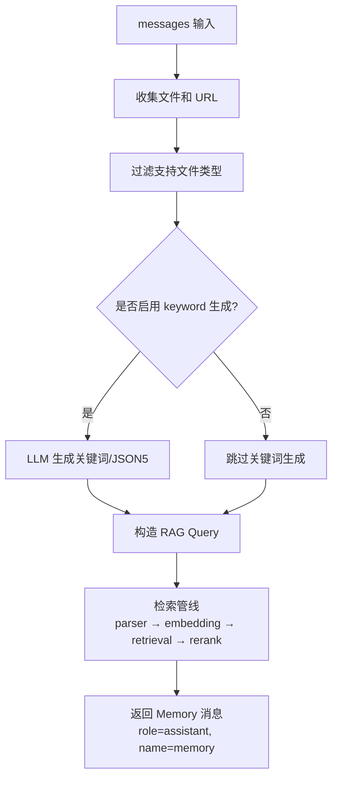
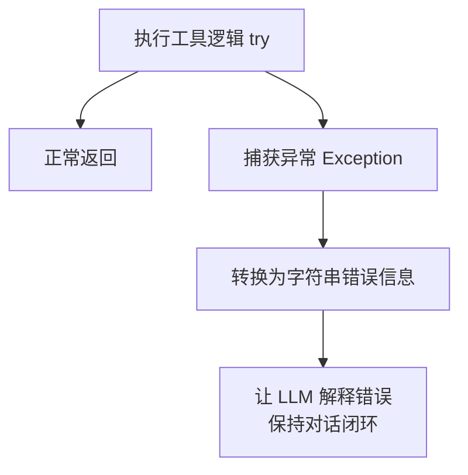

# **📘 Qwen-Agent 框架架构解析**

> 对应源码仓库：

> https://github.com/QwenLM/Qwen-Agent

> 文档包含架构图、循环图、多 Agent 协作图、Memory RAG 数据流图、工具体系图与异常处理图。

> 所有流程均严格基于源码实现，无推测成分。

---

# **1. 🎯 设计理念（Design Philosophy）**

Qwen-Agent 的核心目标是：

**通过统一抽象、模块化组件与 LLM+工具闭环，实现可扩展且可编排的智能 Agent 体系。**

### **核心理念**

- **统一抽象**：所有 Agent 都继承 Agent，通过 \_run 处理消息，上层只依赖统一入口。
- **LLM+工具闭环**：FnCallAgent 完成 “LLM 推理 → 工具决策 → 工具执行 → 回写上下文” 的完整循环。
- **模块化扩展**：工具、Memory、子 Agent 可自由组合，可复用性强。
- **默认流式**：全链路支持流式输出，提高交互体验。
- **文件/RAG 模块独立**：Memory 负责文件抽取、解析与检索。

---

# **2. 🧩 核心组件结构（Core Components）**

## **2.1 Agent 基类（骨架层）**

Agent.run() 负责：

- 标准化消息
- 自动插入 system prompt
- 自动语言检测（如中文 → lang=zh）
- 统一构建 LLM 请求参数
- 调用子类 \_run

---

## **2.2 Message Schema（所有信息流的基础）**

来自 llm/schema.py，Qwen-Agent 完全兼容 OpenAI 格式。

```
{
  "role": "system | user | assistant | function",
  "content": "string or ContentItem[]",
  "function_call": {
      "name": "工具名称",
      "arguments": "JSON 字符串"
  },
  "tool_calls": [
      // 多工具版本
  ]
}
```

### **ContentItem 类型**

| **类型**   | **示例**                        | **用途**        |
| ---------- | ------------------------------- | --------------- |
| text       | {“type”:“text”,“text”:“你好”}   | 普通文本        |
| url        | {“type”:“url”,“url”:“http://…”} | Memory 识别文件 |
| image/file | {“type”:“image_url”,“url”:”…”}  | 文件透传        |

---

# **3. 🔁 FnCallAgent 主循环（LLM+工具闭环）**

## **3.1 完整循环流程（100% Mermaid 兼容版）**



---

## **3.2 为什么必须 accumulate（累积 chunk）？**

流式输出中 function_call 经常被拆成多段：

```
{"funct
ion_call":{"name":"search","arguments":"{"
```

如果不对 chunk 进行累积，会导致：

- JSON 结构不完整 → 无法解析工具名称
- 工具永远无法被调用
- LLM 无法进入正确循环

---

# **4. 🔧 工具体系（Tools & JSON Schema）**

## **4.1 工具定义与注册**

```
@register_tool("search")
class SearchTool(BaseTool):
    description = "搜索互联网"
    params = {
        "query": {"type": "string", "description": "搜索词"}
    }
    def call(self, params):
        ...
```

---

## **4.2 工具 JSON Schema 构建图（Mermaid 兼容）**



工具 Schema 会直接影响：

- LLM 是否选择调用工具
- 参数如何填充
- 调用概率

---

# **5. 🧠 MultiAgentHub & 路由（Router）**

MultiAgentHub 是一个 **容器 + 约束层**：

- Agent 名字唯一
- 类型必须为 Agent
- 不负责路由逻辑

## **5.1 多 Agent 协作流程图（修正版）**



---

# **6. 📚 Memory（文件/RAG Agent）**

Memory 是一个 **复合型 Agent**，内部通常包含：

- 文件提取（extract）
- 文档解析（parser）
- 向量检索（retrieval）
- 重排（rerank）

---

## **6.1 Memory 真实数据流（100% Mermaid 兼容版）**



---

# **7. ⚙ 配置体系（Config System）**

| **组件** | **配置方式**       | **作用**                         |
| -------- | ------------------ | -------------------------------- |
| Agent    | extra_generate_cfg | 温度、seed、top_p、lang          |
| LLM      | 初始化参数         | 模型级默认配置                   |
| Tool     | 工具定义           | 描述、Schema、文件访问能力       |
| Memory   | 初始化参数         | chunk 大小、top_k、parser 配置等 |

---

# **8. 🧨 异常处理（Exception Handling）**

Qwen-Agent 中，所有异常都统一处理并回写为自然语言交给 LLM↓



---

# **9. 🕳 常见坑位（踩坑指南）**

## **9.1**

## **<think>**

## **流式拆包**

模型可能输出：

```
<think>
用户提到了……
```

→ 必须作为单独包处理，否则污染 function_call。

---

## **9.2 工具返回必须是字符串**

返回 dict 会导致 LLM 无法解析。

---

## **9.3 system prompt 会不断 append**

长对话时需裁剪防膨胀。

---

## **9.4 files 必须通过 ContentItem 透传**

否则 Memory 工具拿不到 URL。

---

## **9.5 Router 决策错误会导致死循环**

必须依赖 MAX_LLM_CALL_PER_RUN。

---

# **10. 🧭 实战建议（Best Practices）**

- 新 Agent → 继承 FnCallAgent
- 新工具 → 继承 BaseTool / BaseToolWithFileAccess
- 构建 Router → 基于 MultiAgentHub
- 文件 / RAG 处理 → 使用 Memory
- Stream 模式 → 必须 accumulate chunk

---

# **📦 附录：推荐项目文档结构**

```
Qwen-Agent/
  ├── 1-overview.md
  ├── 2-agent-architecture.md
  ├── 3-tool-system.md
  ├── 4-memory-rag.md
  ├── 5-router-multiagent.md
  ├── 6-exception-handling.md
  ├── 7-best-practices.md
  └── 8-common-pitfalls.md
```
