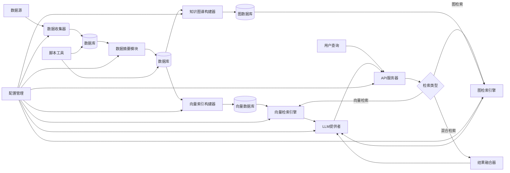

# Personal AI 项目模块功能和交互关系

## 1. 数据收集层 (Data Collection Layer)

### 1.1 笔记收集器 (Notes Collector)
- **文件**: `collectors/notes_collector.py`
- **功能**: 
  - 递归读取指定目录下的 Markdown 笔记文件
  - 解析 frontmatter 格式的元数据（标题、标签、创建时间等）
  - 将笔记数据存储到数据库的 `note` 表中
  - 支持增量更新，避免重复导入

### 1.2 博客收集器 (Blogs Collector)
- **文件**: `collectors/blogs_collector.py`
- **功能**:
  - 递归读取指定目录下的 Markdown 博客文件
  - 解析 frontmatter 格式的元数据（标题、作者、标签、发布日期等）
  - 将博客数据存储到数据库的 `blog` 表中
  - 支持增量更新

### 1.3 照片收集器 (Photos Collector)
- **文件**: `collectors/photos_collector.py`
- **功能**:
  - 扫描指定目录下的图片文件（支持 JPEG、PNG、HEIC、RAW 等格式）
  - 提取 EXIF 信息（拍摄时间、相机型号、GPS 坐标等）
  - 将照片元数据存储到数据库的 `photo` 表中
  - 支持多种图片格式的处理

## 2. 数据处理层 (Data Processing Layer)

### 2.1 数据库模型 (Database Models)
- **文件**: `db/models.py`
- **功能**:
  - 定义数据表结构：Note、Blog、Photo、UnifiedEmbedding
  - 使用 SQLAlchemy ORM 映射数据库表
  - UnifiedEmbedding 表用于存储统一的向量嵌入表示

### 2.2 数据摘要模块 (Summarizer)
- **文件**: `summarizer/summarizer.py`
- **功能**:
  - 使用 LLM 对文本内容进行分析，生成摘要和标签
  - 使用视觉 LLM 对图片内容进行分析，生成描述和标签
  - 提供文本文件和图片文件的摘要接口

### 2.3 格式化器 (Formatter)
- **文件**: `rag_engine/formatters/formatter.py`
- **功能**:
  - 将结构化数据（Note、Blog、Photo）转换为统一的文本格式
  - 为向量嵌入生成标准化的输入文本

## 3. 向量索引层 (Vector Index Layer)

### 3.1 向量索引构建器 (Vector Index Builder)
- **文件**: `rag_engine/vector_rag/build_index.py`
- **功能**:
  - 从数据库中读取结构化数据
  - 使用格式化器将数据转换为统一文本格式
  - 调用嵌入模型生成向量嵌入
  - 将向量嵌入存储到 UnifiedEmbedding 表中

### 3.2 向量数据库 (Vector Database)
- **实现**: PostgreSQL + pgvector
- **功能**:
  - 存储高维向量嵌入数据
  - 支持向量相似性搜索（余弦距离计算）

## 4. 知识图谱层 (Knowledge Graph Layer)

### 4.1 知识图谱构建器 (Graph Builder)
- **文件**: `graph/graph_builder.py`
- **功能**:
  - 从数据库中读取结构化数据
  - 提取实体和关系信息
  - 构建知识图谱并存储到图数据库

### 4.2 图数据库 (Graph Database)
- **实现**: Neo4j
- **功能**:
  - 存储知识图谱的节点和关系
  - 支持复杂的图查询和遍历

## 5. 查询服务层 (Query Service Layer)

### 5.1 API 服务器 (API Server)
- **文件**: `server/app.py`
- **功能**:
  - 提供 FastAPI 服务
  - 实现与 OpenAI 兼容的 `/v1/chat/completions` 接口
  - 支持流式和非流式响应

### 5.2 向量检索引擎 (Vector Retrieval Engine)
- **文件**: `rag_engine/vector_rag/query_engine.py`
- **功能**:
  - 实现向量相似性搜索
  - 结合检索到的上下文和用户问题生成回答
  - 支持同步和流式回答模式

### 5.3 图检索引擎 (Graph Retrieval Engine)
- **文件**: `graph/query_graph.py`
- **功能**:
  - 基于知识图谱的检索引擎
  - 支持复杂的图查询和遍历
  - 提供实体关系查询和上下文检索

### 5.4 结果融合器 (Result Merger)
- **文件**: `graph/result_merger.py`
- **功能**:
  - 融合向量检索和图检索的结果
  - 根据相关性评分加权合并结果
  - 提供统一的检索结果接口

### 5.5 LLM 提供者 (LLM Providers)
- **文件**: `llm/providers.py`
- **功能**:
  - 提供不同类型的 LLM 模型实例
  - 包括文本生成模型、嵌入模型、视觉模型等
  - 支持 Ollama 作为模型后端

## 6. 配置管理层 (Configuration Management Layer)

### 6.1 服务器配置 (Server Configuration)
- **文件**: `server/config.py`
- **功能**:
  - 管理环境变量配置
  - 定义数据目录路径
  - 配置模型参数和 API 端口

### 6.2 依赖管理 (Dependency Management)
- **文件**: `requirements.txt`
- **功能**:
  - 管理项目依赖包
  - 包含 LLM 相关库、数据库驱动、Web 框架等

## 7. 脚本工具层 (Script Tools Layer)

### 7.1 表结构创建脚本 (Table Creation Script)
- **文件**: `scripts/create_tables.py`
- **功能**:
  - 根据数据模型自动创建数据库表结构

### 7.2 数据导入脚本 (Data Import Script)
- **文件**: `scripts/import_personal_data.py`
- **功能**:
  - 自动化执行数据收集和摘要流程
  - 提供完整的数据处理入口

## 模块交互关系

## 核心数据流

1. **数据收集阶段**:
   - 数据源 → 数据收集器 → 数据库 (原始数据表)

2. **数据处理阶段**:
   - 数据库 (原始数据表) → 数据摘要模块 → 数据库 (补充摘要和标签)

3. **向量索引阶段**:
   - 数据库 (完整数据) → 向量索引构建器 → 向量数据库

4. **知识图谱构建阶段**:
   - 数据库 (完整数据) → 知识图谱构建器 → 图数据库

5. **查询服务阶段**:
   - 用户查询 → API服务器 → 检索引擎(向量/图/混合) → 数据库 + LLM提供者 → 响应结果