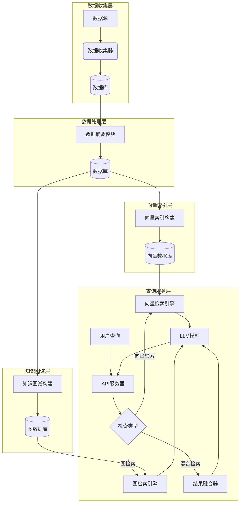

# Personal AI 项目架构

## 模块说明

### 1. 数据源 (Data Sources)
- 笔记 (Notes)
- 博客 (Blogs)
- 照片 (Photos)

### 2. 数据收集器 (Data Collectors)
- `collectors/notes_collector.py` - 收集笔记数据
- `collectors/blogs_collector.py` - 收集博客数据
- `collectors/photos_collector.py` - 收集照片数据

### 3. 数据库 (Database)
- 使用 PostgreSQL 存储原始数据
- 数据模型定义在 `db/models.py`
  - Note: 笔记数据模型
  - Blog: 博客数据模型
  - Photo: 照片数据模型
  - UnifiedEmbedding: 统一向量嵌入模型

### 4. 数据摘要模块 (Summarizer)
- `summarizer/summarizer.py` - 文本和图片摘要生成
- 使用 LLM 生成内容摘要和标签

### 5. 向量索引构建 (Vector Index Building)
- `rag_engine/vector_rag/build_index.py` - 构建向量索引
- 将结构化数据转换为统一格式并生成向量嵌入

### 6. 知识图谱构建 (Graph Building)
- `graph/graph_builder.py` - 构建知识图谱
- 从结构化数据中提取实体和关系，构建知识图谱

### 7. 向量数据库 (Vector Database)
- 使用 PostgreSQL + pgvector 存储向量嵌入

### 8. 图数据库 (Graph Database)
- 使用 Neo4j 存储知识图谱

### 9. API 服务器 (API Server)
- `server/app.py` - FastAPI 服务器
- 提供与 OpenAI 兼容的 API 接口

### 10. 向量检索引擎 (Vector Retrieval Engine)
- `rag_engine/vector_rag/query_engine.py` - 向量检索和问答
- 实现相似性搜索和问答功能

### 11. 图检索引擎 (Graph Retrieval Engine)
- `graph/query_graph.py` - 图检索和问答
- 基于知识图谱的检索和问答功能

### 12. 结果融合器 (Result Merger)
- `graph/result_merger.py` - 融合向量和图检索结果
- 结合两种检索方式的优势

### 13. LLM 模型 (LLM Models)
- `llm/providers.py` - LLM 模型提供者
- 支持多种模型配置